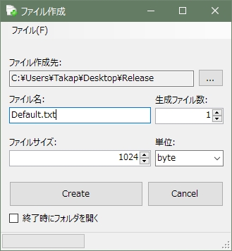

# CreateFileOfAnySize

This is a tool to create files of any size.

任意のサイズのファイルを作成するツールです。

"FileCreator.exe" を起動し、以下の画面から生成を作成します。

作成されるファイルはZip圧縮しても1バイトも圧縮できないファイルになります。

これは、ファイルを生成するための DummyFileUtil クラス内の各メソッドにあるcomplexityを1に近づけることで調整できます。

実装の説明は以下サイトを参照してください。

任意のサイズのファイルを作成するツール - PG日誌

https://takap-tech.com/entry/2021/06/04/213555